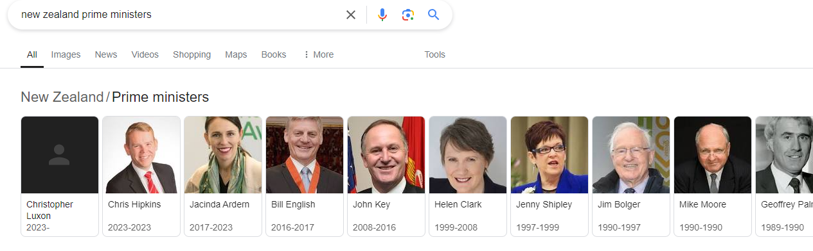

# Extract Van Gogh Paintings Code Challenge

Goal is to extract a list of Van Gogh paintings and New Zeland Prime Ministers from the attached Google search results page.




# Pre-requirements

Please make sure the Chrome and Webdriver are installed correctly.

You can download the latest Chrome and Webdriver from the following link.
[https://googlechromelabs.github.io/chrome-for-testing/]()

# Installation

**Ruby Version 3.2.2**

```
rvm install 3.2.2

bundle install
```

# Usage

The following command will extract the `van-gogh-paintings.html` by default

```
bundle exec ruby extract.rb
```

You can specify the html file for extracting

```
bundle exec ruby extract.rb spec/fixtures/new-zealand-prime-ministers.html
```

# Testing

To execute the Rspec

```
rspec spec
```

# Principle

This program uses selenium to execute HTML and Javascript within it. And use Nokogiri to get the target elements we need.
We can adapt to different page structures by adding different strategies.
